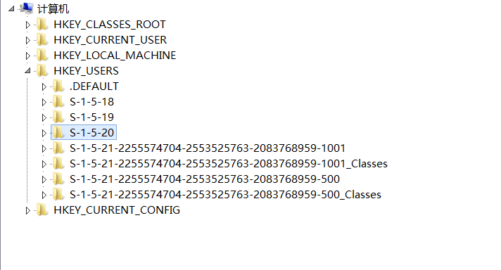
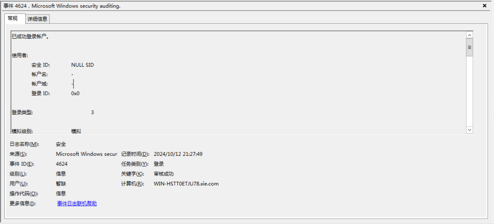

# 注册表查询

用户登入了主机后，在该主机的HKEY_USERS注册表内有该用户的文件夹

使用ADFind.exe查询SID
```bash
AdFind.exe -f "objectsid=S-1-5-21-2255574704-2553525763-2083768959-1001" -dn

#AdFind V01.62.00cpp Joe Richards (support@joeware.net) October 2023

#Using server: WIN-HSTT0ETJU78.xie.com:389
#Directory: Windows Server 2012 R2
#Base DN: DC=xie,DC=com

#dn:CN=win2012r2,CN=Users,DC=xie,DC=com

#1 Objects returned
```

## Psloggedon

[Psloggedon](https://learn.microsoft.com/en-us/sysinternals/downloads/psloggedon)是微软官方工具，用于查询本地登入或者通过远程访问资源的用户，该工具刚好实现了一开始的方法

```
PsLoggedon.exe /accepteula
PsLoggedon.exe /accepteula \\10.0.0.133
PsLoggedon.exe /accepteula \\WIN7.xie.com
```

:::tip
默认普通机器没有开启注册表远程连接，因此无法查询
:::

## PVEFindADUser

[ADFindUsers](https://github.com/chrisdee/Tools/tree/master/AD/ADFindUsersLoggedOn)

查询域中所有机器当前登入的所有用户

```
PVEFindADUser.exe -current -noping
PVEFindADUser.exe -current -target WIN7,WIN2012
PVEFindADUser.exe -current -target 10.0.0.133,10.0.0.138
```

# 域控日志查询

用户登入后会在域控内留下登入日志，该日志的事件ID为4624，登入类型为3

导出系统日志
```
wevtutil epl Security C:\Users\Public\Documents\1.evtx /q:"*[System[(EventID=4624)] and EventData[Data[@Name='LogonType']='3']]
```
[LogParaser.exe](https://www.microsoft.com/en-us/download/details.aspx?id=24659)工具分析日志，生成包含用户名和登入机器的IP的log.csv
```
LogParser.exe -i:EVT -o:CSV "SELECT TO_UPPERCASE(EXTRACT_TOKEN(Strings,5,'|')) as USERNAME,TO_UPPERCASE(EXTRACT_TOKEN(Strings,18,'|')) as SOURCE_IP FROM 1.evtx" > log.csv
```
导出的用户都是大写，查询ADMINISTRATOR用户登入过的主机
```
cat log.csv | grep ADMINISTRATOR | sort | uniq
```

## SharpADUserIP
[SharpADUserIP](https://github.com/evilashz/SharpADUserIP)可以查询1-365天的登录日志

```bash
#查询7天内的日志
SharpADUserIP.exe 7
```

## Powershell命令

```powershell
# 定义获取登录事件的函数
function Get-LoginEvents {
    param (
        [int]$Days = 1  # 默认获取一天前的日志
    )

    # 计算天数对应的毫秒数
    $startDate = $Days * 24 * 60 * 60 * 1000

    # XML 查询：筛选符合条件的事件ID和时间范围的日志
$xml = @"
<QueryList>
    <Query Id="0" Path="Security">
    <Select Path="Security">*[System[(EventID=4624) and TimeCreated[timediff(@SystemTime) &lt;= $startDate]]]</Select>
    </Query>
</QueryList>
"@

    $events = Get-WinEvent -FilterXml $xml
    $i=0
    Write-Host '登录时间','登录账号','登录类型','登录IP地址'
    while ($i -lt $events.length) {
        $time=$events[$i].TimeCreated
        $type=[regex]::matches($events[$i].Message, '登录类型:(.+)') | %{$_.Groups[1].Value.Trim()}
        $user=([regex]::matches($events[$i].Message, '帐户名:(.+)') | %{$_.Groups[1].Value.Trim()})[1]
        $IP=[regex]::matches($events[$i].Message, '源网络地址:(.+)') | %{$_.Groups[1].Value.Trim()}
        Write-Host $time,$user,$type,$IP
        $i++
    }
}
```

使用

```
Import-Module .\Get-LoginEvents.ps1

Get-LoginEvents -Days 7
```